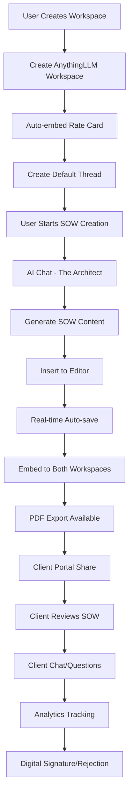

# 🌱 Social Garden SOW Generator - Complete Project Overview

**Generated:** October 26, 2025  
**Version:** 1.0.0  
**Status:** Production Ready  

This document provides a comprehensive overview of the Social Garden Statement of Work (SOW) Generator system for AI handover and complete project understanding.

---

## 🎯 Executive Summary

Social Garden SOW Generator is a production-ready, AI-powered document generation platform that creates professional Statement of Work documents for digital marketing and CRM implementation projects. The system combines AI (via AnythingLLM), interactive pricing tables, rich text editing, and enterprise-grade PDF export capabilities.

**Core Value Proposition:**
- **AI-Powered Content Generation**: Uses "The Architect" AI agent to generate complete, professional SOWs
- **Accurate Pricing Integration**: 82+ granular roles with real-time rate calculations
- **Interactive Rich Editor**: TipTap/ProseMirror with drag-drop pricing tables
- **Professional PDF Export**: Social Garden branded PDFs with proper typography
- **Client Portal Integration**: Share SOWs with clients for review and digital signatures
- **Enterprise AI Integration**: AnythingLLM for workspace-based chat and analytics

---

## 🏗️ System Architecture

### High-Level Architecture

```
┌─────────────────────────────────────────────────────────────────┐
│                           FRONTEND (Next.js)                    │
│  ┌─────────────────┐ ┌─────────────────┐ ┌─────────────────┐    │
│  │   Dashboard     │ │   Editor        │ │   AI Chat       │    │
│  │   Analytics     │ │   (TipTap)      │ │   (AnythingLLM) │    │
│  │   & Filtering   │ │   + Pricing     │ │                 │    │
│  └─────────────────┘ └─────────────────┘ └─────────────────┘    │
└─────────────────────────────────────────────────────────────────┘
                                     │
                    ┌────────────────┼────────────────┐
                    │                │                │
        ┌───────────▼──────────┐    │    ┌───────────▼──────────┐
        │    MySQL Database     │    │    │     FastAPI Service     │
        │   (Activity Tracking) │    │    │    (PDF + Sheets)      │
        └───────────────────────┘    │    └───────────────────────┘
                                     │
                    ┌────────────────▼────────────────┐
                    │       AnythingLLM Service        │
                    │   ┌─────────────┬─────────────┐ │
                    │   │   Client    │    Master   │ │
                    │   │Workspaces  │  Dashboard  │ │
                    │   │            │             │ │
                    │   │ SOW Docs   │ Analytics & │ │
                    │   │ & Chat     │   Search    │ │
                    │   └─────────────┴─────────────┘ │
                    └─────────────────────────────────┘
```

### Technology Stack

**Frontend:**
- **Framework**: Next.js 15.1.4 with App Router
- **Language**: TypeScript
- **UI Components**: Tailwind CSS, Radix UI
- **Editor**: TipTap/ProseMirror (rich text editor)
- **State Management**: React hooks and context
- **Build Tool**: Vite (via Next.js)

**Backend:**
- **Service**: FastAPI (Python) on port 8000
- **PDF Generation**: WeasyPrint with Jinja2 templates
- **External APIs**: Google Sheets integration
- **OAuth**: Google OAuth for Sheets access

**Database:**
- **Primary**: MySQL 8.0 (168.231.115.219:3306)
- **Schema**: 8 main tables for SOWs, activities, comments, acceptances
- **Storage**: Document content, activity logs, client interactions

**AI Integration:**
- **Platform**: AnythingLLM (ahmad-anything-llm.840tjq.easypanel.host)
- **AI Models**: OpenRouter/Groq providers
- **Architecture**: Dual-workspace system (client + master dashboard)
- **Features**: Streaming chat, document embedding, thread management

**Infrastructure:**
- **Deployment**: Docker, Docker Compose
- **Production VPS**: 168.231.115.219
- **SSL/HTTPS**: Nginx reverse proxy
- **File Storage**: Local filesystem for PDFs, logos

---

## 🗄️ Database Schema

The system uses a comprehensive MySQL schema with 8 core tables:

### Main Tables

1. **`folders`** - Workspace organization
   - `id`, `name`, `workspace_slug`, `embed_id`
   - Maps to AnythingLLM workspaces
   - Stores chat embed configuration

2. **`sows`** - Core SOW documents
   - `id`, `title`, `content` (TipTap JSON), `total_investment`
   - `workspace_slug`, `thread_slug` (AnythingLLM integration)
   - `status` (draft, sent, viewed, accepted, declined)
   - `vertical`, `service_line` (Business Intelligence tagging)

3. **`sow_activities`** - Activity tracking
   - Event types: `sow_created`, `sow_opened`, `ai_message_sent`
   - Client engagement metrics
   - Real-time analytics data

4. **`sow_comments`** - Threaded client feedback
   - `author_type` (client/agency)
   - `section_id`, `section_title` (context-aware comments)
   - Read/unread tracking

5. **`sow_acceptances`** - Digital signatures
   - `signature_data` (base64), `signature_method`
   - Legal compliance: IP address, user agent, terms acceptance

6. **`sow_rejections`** - Declined proposals
   - `reason` (budget, timeline, scope, vendor, other)
   - AI response tracking, follow-up scheduling

7. **`ai_conversations`** - Chat message logs
   - `buying_signal_detected`, `objection_detected`
   - Sentiment analysis and metadata

8. **`active_sows_dashboard`** - Performance view
   - Aggregated metrics, engagement analytics
   - Real-time dashboard data

### Business Intelligence Features

- **Vertical Tagging**: 9 categories (property, education, finance, etc.)
- **Service Line Tagging**: 7 categories (CRM, marketing automation, etc.)
- **Client Analytics**: View counts, engagement metrics
- **Revenue Tracking**: Total investment, acceptance rates

---

## 🤖 AI Integration: AnythingLLM

### Architecture

The system uses a **dual-workspace architecture**:

1. **Client Workspaces** (e.g., "hello", "pho", "abc-corp")
   - Individual workspaces for each client
   - Contains: SOW documents, rate cards, chat history
   - Thread per SOW for isolated conversations

2. **Master Dashboard** ("sow-master-dashboard")
   - Global analytics and reporting
   - Cross-client insights and search
   - Aggregated SOW content

### Core Integration Points

#### Workspace Management
```typescript
// Create/update workspaces
anythingLLM.createOrGetClientWorkspace(clientName)

// Embed rate cards (single source of truth)
anythingLLM.embedRateCardDocument(workspaceSlug)

// Dual-embed SOWs (client + master)
anythingLLM.embedSOWInBothWorkspaces(workspaceSlug, title, content)
```

#### Thread Management
```typescript
// Create thread per SOW (auto-named by first message)
anythingLLM.createThread(workspaceSlug, threadName)

// Load chat history
anythingLLM.getThreadChats(workspaceSlug, threadSlug)

// Stream chat responses
anythingLLM.streamChatWithThread(workspaceSlug, threadSlug, message, callback)
```

#### Chat Integration
- **Streaming Responses**: Real-time AI responses with thinking display
- **Context Awareness**: AI accesses embedded SOW content + rate cards
- **Rate Card Integration**: 82+ roles with live pricing queries
- **File Attachments**: Support for client document uploads

### API Endpoints

**Key AnythingLLM endpoints used:**
- `POST /api/v1/workspace/new` - Create workspace
- `POST /api/v1/document/raw-text` - Process documents
- `POST /api/v1/workspace/{slug}/update-embeddings` - Embed documents
- `POST /api/v1/workspace/{slug}/stream-chat` - Streaming chat
- `POST /api/v1/workspace/{slug}/thread/new` - Create threads
- `GET /api/v1/workspace/{slug}/thread/{slug}/chats` - Load history

---

## 🎨 Frontend Architecture

### Main Application (`/frontend/app/page.tsx`)

The core application has three main views:

#### 1. Dashboard View
- **Purpose**: Analytics, filtering, and SOW overview
- **Features**: 
  - Grid/list view of all SOWs
  - Filter by vertical/service line
  - Revenue analytics
  - Real-time activity tracking
- **Component**: `EnhancedDashboard`

#### 2. Editor View  
- **Purpose**: SOW creation and editing
- **Features**:
  - TipTap rich text editor
  - Interactive pricing tables
  - Real-time auto-save
  - AI content insertion
- **Components**: `TailwindAdvancedEditor`, `PricingTableBuilder`

#### 3. AI Chat View
- **Purpose**: Interactive AI assistance
- **Features**:
  - Streaming responses with thinking display
  - Context-aware chat (workspace + document)
  - File attachments support
  - Insert-to-editor functionality
- **Component**: `StatefulDashboardChat`

### Key Components

#### Core UI Components
- **`ResizableLayout`** - Three-panel resizable interface
- **`SidebarNav`** - Workspace and SOW navigation
- **`AgentSidebar`** - AI chat with agent selection
- **`DocumentStatusBar`** - SOW metadata and actions

#### Specialized Components
- **`StreamingThoughtAccordion`** - Collapsible AI reasoning display
- **`MessageDisplayPanel`** - Chat message rendering
- **`WorkspaceCreationProgress`** - Multi-step workspace setup
- **`EnhancedDashboard`** - Analytics and filtering interface

### State Management

#### Application State
```typescript
// Core document state
const [documents, setDocuments] = useState<Document[]>([]);
const [currentDocId, setCurrentDocId] = useState<string | null>(null);

// Workspace state  
const [workspaces, setWorkspaces] = useState<Workspace[]>([]);
const [folders, setFolders] = useState<Folder[]>([]);

// AI chat state
const [chatMessages, setChatMessages] = useState<ChatMessage[]>([]);
const [isChatLoading, setIsChatLoading] = useState(false);
const [streamingMessageId, setStreamingMessageId] = useState<string | null>(null);

// View management
const [viewMode, setViewMode] = useState<'editor' | 'dashboard'>('dashboard');
```

#### Data Flow
1. **Workspace Creation** → AnythingLLM workspace + database folder
2. **SOW Creation** → Database document + AnythingLLM thread + embedding
3. **Chat Messages** → AnythingLLM streaming → Database activity log
4. **Document Edits** → Real-time auto-save → Database update
5. **SOW Sharing** → Portal generation → Client access tracking

---

## 🔧 Backend Services

### FastAPI Service (`/backend/main.py`)

#### Core Endpoints

**PDF Generation**
```python
@app.post("/generate-pdf")
async def generate_pdf(request: PDFRequest)
```
- Converts TipTap JSON to HTML
- Applies Social Garden branding (logo, fonts, colors)
- Uses WeasyPrint for PDF generation
- Returns downloadable PDF file

**Google Sheets Integration**
```python
@app.post("/create-sheet-oauth") 
async def create_sheet_oauth(request: SheetRequestOAuth)
```
- OAuth token handling
- SOW data formatting
- Google Sheets API integration
- Share link generation

**Health Check**
```python
@app.get("/health")
async def health_check()
```
- Service status monitoring
- Load balancer health checks

#### PDF Template System

**Template Structure:**
- **Header**: Social Garden logo (base64 embedded)
- **Body**: SOW content with professional styling
- **Footer**: Company contact information

**CSS Styling:**
- **Font**: Plus Jakarta Sans (professional typography)
- **Colors**: #0e2e33 (dark green), #20e28f (accent green)
- **Layout**: Clean, professional business document
- **Tables**: Branded pricing tables with hover effects

#### Environment Configuration

```bash
# Backend (.env)
GOOGLE_CLIENT_ID=...
GOOGLE_CLIENT_SECRET=...
GOOGLE_REDIRECT_URI=...

# Database
DB_HOST=168.231.115.219
DB_USER=sg_sow_user
DB_PASSWORD=SG_sow_2025_SecurePass!
DB_NAME=socialgarden_sow
```

---

## 🏃‍♂️ Application Flow & User Journey

### Complete SOW Creation Flow



### Detailed Step-by-Step Flow

#### 1. Workspace Setup
```
User Action: Click "New Workspace"
↓
Frontend: call handleCreateWorkspace(name)
↓
Backend: 
  - Create AnythingLLM workspace
  - Embed rate card document
  - Configure with The Architect prompt
  - Create default thread
  - Save to MySQL 'folders' table
↓
Result: Workspace ready with AI chat enabled
```

#### 2. SOW Generation  
```
User Action: Chat with The Architect
↓
Frontend: 
  - Route to AnythingLLM workspace
  - Send streaming chat request
  - Display real-time AI thinking
↓
AnythingLLM:
  - Access embedded rate card
  - Generate complete SOW narrative
  - Include structured JSON for pricing
↓
Frontend: Insert content to editor
```

#### 3. Document Management
```
Editor Actions:
  - Rich text editing (TipTap)
  - Interactive pricing table
  - Real-time auto-save (1.5s debounce)
  - Concurrent AI chat support

Database Sync:
  - Save TipTap JSON to MySQL
  - Update total_investment calculation
  - Track vertical/service_line tags
  - Log activity events
```

#### 4. Client Portal Flow
```
Share Action:
  - Generate secure portal URL
  - Copy to clipboard
  - Send to client

Client Experience:
  - Access portal without login
  - View SOW with animations
  - Ask AI questions about content
  - Download PDF, provide feedback
  - Digital signature or rejection

Analytics:
  - Track view time, sections viewed
  - Monitor buying signals in chat
  - Log acceptance/rejection with reasons
  - Real-time notifications to agency
```

---

## 💰 Pricing System

### Rate Card Structure

The system uses **82+ granular roles** from a single source of truth:

#### Core Role Categories
- **Account Management**: Head Of ($365), Director ($295), Manager ($180), Coordinator ($120)
- **Project Management**: Head Of ($295), Senior PM ($210), PM ($180)  
- **Tech - Head Of**: Senior PM ($365), Systems ($365), Customer Success ($365)
- **Tech - Producer**: All roles at $120 (Email, Design, Dev, Integration, etc.)
- **Tech - Specialist**: Most roles at $180 (Campaign, Integration, Reporting, etc.)
- **Tech - Sr. Architect**: All roles at $365 (App Dev, Consultation, Data Migration)
- **Creative**: Designer ($130), Senior Designer ($150), Art Director ($140)
- **Content**: Copywriter ($140), SEO Strategy ($210), Content Strategy ($160)

### Pricing Table Features

#### Interactive Pricing Table
- **Drag-drop reordering** of roles
- **Real-time calculations** (hours × rate = total)
- **Discount application** with percentage/currency
- **Tax calculation** (10% GST for Australia)
- **Export to Excel** with formatting

#### Pricing Validation Rules
```
Mandatory Roles (Always Required):
- Tech - Head Of - Senior Project Management: 5-15 hours
- Tech - Delivery - Project Coordination: 3-10 hours  
- Account Management - Senior Account Manager: 6-12 hours

Role Ordering Enforcement:
- Account Management roles MUST appear at BOTTOM
- Strategic roles first, then delivery, then account management
- Use granular Producer/Specialist roles, not generic "Developer"
```

#### Commercial Presentation
- **Currency**: AUD only with "+GST" suffix
- **Rounding**: Target clean numbers ($50k, $45k, $60k)
- **Discount Display**: Show original → discount → final price
- **Retainer Format**: Monthly breakdown + annual totals

---

## 🔐 Security & Compliance

### Authentication & Authorization

#### Google OAuth Integration
- **Purpose**: Google Sheets access for SOW export
- **Flow**: OAuth → access token → Sheets API
- **Security**: Token encoding, secure storage

#### API Security
- **CORS**: Configured for frontend domain
- **Rate Limiting**: Implemented in chat endpoints
- **Environment Variables**: Secure credential storage

### Data Privacy & Legal

#### Client Data Protection
- **Workspace Isolation**: Each client in separate AnythingLLM workspace
- **Data Encryption**: Base64 encoding for sensitive data
- **Access Logging**: Complete audit trail of client interactions

#### Digital Signatures
- **Legal Compliance**: IP address, user agent, timestamp logging
- **Signature Methods**: Canvas drawing, typed, file upload
- **Terms Acceptance**: Required legal checkbox
- **Rejection Tracking**: Reason codes with free-form details

### GDPR/Privacy Compliance
- **Data Retention**: Configurable retention policies
- **Client Consent**: Clear opt-in for AI chat and analytics  
- **Export Rights**: Client can export their SOW data
- **Deletion Rights**: Support for data deletion requests

---

## 📊 Analytics & Business Intelligence

### Dashboard Metrics

#### Engagement Tracking
- **View Analytics**: Total views, unique visitors, time spent
- **Section Analytics**: Which parts of SOWs clients focus on
- **Chat Analytics**: AI conversations, buying signals, objections
- **Conversion Funnel**: Views → Chat → Questions → Acceptance

#### Revenue Analytics
- **Pipeline Tracking**: Draft → Sent → Viewed → Accepted
- **Service Line Performance**: Which services convert best
- **Vertical Analysis**: Performance by industry (property, education, etc.)
- **Seasonal Trends**: Monthly/quarterly performance patterns

#### AI Performance Metrics
- **Response Quality**: Client satisfaction with AI answers
- **Topic Analysis**: Common client questions and concerns
- **Buying Signal Detection**: AI-identified purchase intent
- **Response Time**: AI chat latency and availability

### Real-time Notifications

#### Agency Dashboard
- **Live Activity**: Real-time client SOW interactions
- **Alert System**: When clients view SOWs, ask questions
- **Weekly Reports**: Automated performance summaries
- **Custom Filters**: By client, service line, date range

---

## 🚀 Deployment & Infrastructure

### Production Environment

#### Infrastructure Stack
```
VPS: 168.231.115.219
├── Frontend: Next.js on port 3333
├── Backend: FastAPI on port 8000  
├── Database: MySQL on port 3306
├── Reverse Proxy: Nginx (SSL/HTTPS)
└── File Storage: Local filesystem
```

#### Docker Configuration
```yaml
# docker-compose.prod.yml
version: '3.8'
services:
  frontend:
    build: ./frontend
    ports: ["3333:3333"]
    environment:
      - NEXT_PUBLIC_ANYTHINGLLM_URL=${ANYTHINGLLM_URL}
      - NEXT_PUBLIC_ANYTHINGLLM_API_KEY=${ANYTHINGLLM_API_KEY}
  
  backend:
    build: ./backend
    ports: ["8000:8000"]
    environment:
      - DATABASE_URL=${DATABASE_URL}
      - GOOGLE_CLIENT_ID=${GOOGLE_CLIENT_ID}
```

#### Environment Variables
```bash
# Production .env
DB_HOST=168.231.115.219
DB_USER=sg_sow_user  
DB_PASSWORD=SG_sow_2025_SecurePass!
DB_NAME=socialgarden_sow

ANYTHINGLLM_URL=https://ahmad-anything-llm.840tjq.easypanel.host
ANYTHINGLLM_API_KEY=0G0WTZ3-6ZX4D20-H35VBRG-9059WPA

NEXT_PUBLIC_BASE_URL=https://sow.qandu.me
NEXT_PUBLIC_API_URL=http://localhost:8000
```

### Development Workflow

#### Local Development
```bash
# Start all services
./dev.sh

# Individual services
cd frontend && pnpm dev      # Port 3333
cd backend && uvicorn main:app --reload  # Port 8000
```

#### Git Workflow
```bash
git checkout -b feature/your-feature
git add -A
git commit -m "feat: your feature description"  
git push origin feature/your-feature
```

---

## 🧪 Testing & Quality Assurance

### Testing Strategy

#### Unit Testing
- **Frontend**: Jest + React Testing Library for components
- **Backend**: Pytest for API endpoints
- **Database**: SQL tests for schema migrations

#### Integration Testing
- **AnythingLLM Integration**: Test workspace creation, chat, embedding
- **PDF Generation**: Validate template rendering and styling
- **Client Portal**: End-to-end client journey testing

#### Performance Testing
- **Load Testing**: Multiple concurrent SOW generations
- **Database Performance**: Query optimization, indexing
- **AI Response Time**: AnythingLLM streaming latency

### Quality Gates
- **Code Coverage**: Minimum 80% coverage requirement
- **Security Scanning**: Dependency vulnerability checks  
- **Performance Budgets**: Page load < 3s, AI response < 5s
- **Accessibility**: WCAG 2.1 AA compliance

---

## 📚 Documentation & Knowledge Base

### Key Documentation Files

#### Technical Documentation
- **`README.md`**: Main project documentation, quick start
- **`00-ANYTHINGLLM-INTEGRATION-DOCUMENTATION.md`**: Complete AI integration guide
- **`SOW-WORKSPACE-FLOW.md`**: SOW lifecycle and workspace synchronization
- **`database/schema.sql`**: Complete database schema with indexes

#### Business Documentation  
- **`QA-SINGLE-SOURCE-OF-TRUTH.md`**: Quality assurance requirements
- **`COMPREHENSIVE-AI-PROMPT-DOCUMENT.md`**: AI prompt engineering guide
- **`SOW-TAGGING-SYSTEM.md`**: Business intelligence tagging system

#### API Documentation
- **`ANYTHINGLLM-ENDPOINTS-REFERENCE.md`**: Complete API reference
- **`frontend/app/api/`**: Next.js API routes documentation

### Knowledge Base Content

#### The Architect AI System
```typescript
// AI prompt system with rate card injection
export const THE_ARCHITECT_V2_PROMPT = `
You are 'The Architect,' the most senior proposal specialist at Social Garden.
[Complete prompt with rate card rules, formatting requirements, JSON output structure]
`

// Rate card as single source of truth  
export const SOCIAL_GARDEN_KNOWLEDGE_BASE = {
  rateCard: { /* 82+ roles with rates */ },
  mandatoryRoles: { /* Required roles */ },
  projectTypes: { /* SOW type definitions */ }
}
```

#### Prompt Engineering
- **Role Allocation Rules**: Specific hours for Head Of, Project Coordination, Account Management
- **Output Format**: Markdown narrative + JSON pricing table
- **Commercial Presentation**: AUD currency, +GST suffix, rounding rules
- **Quality Enforcement**: Validation checkpoints, zero deviation tolerance

---

## 🔄 Integration Points

### External Services

#### AnythingLLM Platform
- **URL**: https://ahmad-anything-llm.840tjq.easypanel.host
- **API Key**: 0G0WTZ3-6ZX4D20-H35VBRG-9059WPA
- **Usage**: Chat, document embedding, workspace management
- **Architecture**: Dual-workspace (client + master dashboard)

#### Google Services
- **Google Sheets**: SOW export and collaboration
- **Google OAuth**: Secure authentication flow
- **Google Fonts**: Plus Jakarta Sans typography

#### Email/Communication
- **SMTP**: For client notifications (future enhancement)
- **Slack**: For agency team notifications (future enhancement)

### Internal Integrations

#### Database Layer
- **MySQL**: Primary data storage
- **Migration System**: Version-controlled schema changes
- **Backup Strategy**: Automated daily backups

#### File Storage
- **PDF Storage**: Local filesystem with CDN (future)
- **Logo Assets**: Base64 embedded in PDFs
- **Export Files**: Temporary storage for downloads

---

## 🐛 Known Issues & Technical Debt

### Current Limitations

#### Performance Issues
- **Bundle Size**: Frontend bundle could be optimized
- **Database Queries**: Some N+1 query patterns exist
- **Image Optimization**: Next.js image optimization not fully utilized

#### Feature Gaps
- **Mobile Responsiveness**: Some components need mobile optimization
- **Offline Support**: No PWA capabilities yet
- **Real-time Collaboration**: No multi-user editing support

#### Infrastructure Concerns
- **Single VPS**: No horizontal scaling yet
- **Database Backup**: Manual backup process
- **Monitoring**: Basic health checks, need comprehensive monitoring

### Future Enhancements

#### Planned Features
- **Multi-tenant Architecture**: Support multiple agencies
- **Advanced Analytics**: Machine learning insights
- **Mobile App**: React Native companion app
- **API Rate Limiting**: Per-user limits and quotas

#### Technical Improvements  
- **Microservices**: Split backend into focused services
- **Event Sourcing**: Complete audit trail system
- **GraphQL**: Replace REST with GraphQL API
- **Kubernetes**: Container orchestration

---

## 🏆 Success Metrics & KPIs

### Business Metrics

#### Client Engagement
- **SOW Acceptance Rate**: Target >70% acceptance
- **Average Time to Accept**: Target <7 days
- **Client Satisfaction**: Target >4.5/5 rating
- **Repeat Business**: Target >80% client retention

#### Revenue Impact
- **Proposal Generation Speed**: 10x faster than manual
- **Pricing Accuracy**: 100% rate card compliance  
- **Upsell Rate**: Additional services from AI recommendations
- **Market Expansion**: New verticals from BI insights

#### Operational Efficiency
- **Time to First SOW**: <5 minutes from workspace creation
- **PDF Generation Time**: <30 seconds
- **System Uptime**: Target 99.9%
- **AI Response Accuracy**: Target >95% helpful responses

### Technical Metrics

#### Performance Targets
- **Page Load Time**: <3 seconds
- **AI Chat Response**: <5 seconds streaming start
- **Database Query Time**: <100ms average
- **PDF Generation**: <30 seconds

#### Quality Metrics
- **Code Coverage**: >80%
- **Security Vulnerabilities**: 0 critical, <5 minor
- **Accessibility Score**: WCAG 2.1 AA compliance
- **Browser Compatibility**: Support for last 2 versions of major browsers

---

## 🎯 Strategic Recommendations

### Immediate Priorities (Next 30 Days)

1. **Performance Optimization**
   - Bundle size reduction
   - Database query optimization
   - CDN implementation

2. **Security Hardening**
   - API rate limiting implementation
   - Security audit and penetration testing
   - Environment variable security review

3. **Monitoring & Observability**
   - Comprehensive logging system
   - Performance monitoring dashboard
   - Error tracking and alerting

### Medium-term Goals (Next 90 Days)

1. **Feature Enhancement**
   - Mobile responsiveness improvements
   - Advanced filtering and search
   - Batch SOW operations

2. **Scalability Preparation**
   - Database sharding strategy
   - Microservices architecture planning
   - Load balancing implementation

3. **Business Intelligence**
   - Advanced analytics dashboard
   - Predictive modeling for acceptance rates
   - Automated reporting system

### Long-term Vision (Next 12 Months)

1. **Platform Evolution**
   - Multi-tenant SaaS platform
   - White-label solutions
   - API marketplace integration

2. **AI/ML Enhancement**
   - Custom model fine-tuning
   - Predictive pricing optimization
   - Automated proposal generation

3. **Market Expansion**
   - International market support
   - Additional industry verticals
   - Partnership integrations

---

## 📞 Key Contacts & Resources

### Development Team
- **Lead Developer**: Available via GitHub issues
- **DevOps**: Contact through repository maintainers
- **Product Owner**: Through project management tools

### External Services
- **AnythingLLM Support**: https://anythingllm.com/
- **FastAPI Documentation**: https://fastapi.tiangolo.com/
- **Next.js Documentation**: https://nextjs.org/docs

### Infrastructure Support
- **VPS Provider**: 168.231.115.219 hosting support
- **Domain/DNS**: sow.qandu.me management
- **SSL Certificates**: Let's Encrypt automated renewal

---

## 📋 Appendices

### Appendix A: Database Schema Reference
- Complete table definitions with indexes
- Foreign key relationships
- Sample data and queries

### Appendix B: API Endpoint Documentation  
- Complete REST API reference
- Authentication requirements
- Rate limiting policies
- Error response formats

### Appendix C: AI Prompt Engineering Guide
- The Architect prompt variations
- Rate card injection system
- Quality assurance checkpoints
- Troubleshooting common issues

### Appendix D: Deployment Checklist
- Pre-deployment verification steps
- Post-deployment testing procedures
- Rollback procedures
- Monitoring setup

---

**Document Version**: 1.0.0  
**Last Updated**: October 26, 2025  
**Status**: Production Ready  
**Next Review**: November 26, 2025  

This comprehensive overview provides complete project understanding for AI systems, developers, and stakeholders. For specific technical questions, refer to the detailed documentation files listed in the Knowledge Base section.
