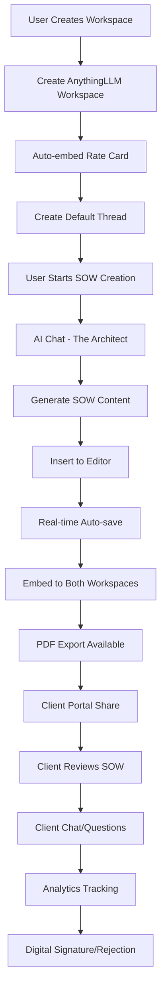

# 🌱 Social Garden SOW Generator - Complete AI Prompt Guide

**For AI Systems:** This document provides complete context for understanding and working with the Social Garden Statement of Work Generator system. Use this to understand the architecture, make modifications, or build similar systems.

---

## 📋 Project Overview

### Core Purpose
Social Garden SOW Generator is a production-ready, AI-powered document generation platform that creates professional Statement of Work documents for digital marketing and CRM implementation projects. The system combines:

- **AI-Powered Content Generation** using "The Architect" agent
- **82+ Granular Roles** with real-time rate calculations  
- **Interactive Rich Text Editor** (TipTap/ProseMirror)
- **Professional PDF Export** with Social Garden branding
- **Client Portal Integration** for review and digital signatures
- **AnythingLLM Integration** for workspace-based chat and analytics

### Business Model
- **Target Users:** Digital marketing agencies, CRM implementation firms
- **Revenue Model:** SaaS platform for SOW generation with client portal
- **Key Value:** 10x faster proposal generation, 100% pricing accuracy, professional presentation
- **Success Metrics:** >70% acceptance rate, <7 days average time to accept

---

## 🏗️ System Architecture

### High-Level Architecture
```
┌─────────────────────────────────────────────────────────────────┐
│                           FRONTEND (Next.js)                    │
│  ┌─────────────────┐ ┌─────────────────┐ ┌─────────────────┐    │
│  │   Dashboard     │ │   Editor        │ │   AI Chat       │    │
│  │   Analytics     │ │   (TipTap)      │ │   (AnythingLLM) │    │
│  │   & Filtering   │ │   + Pricing     │ │                 │    │
│  └─────────────────┘ └─────────────────┘ └─────────────────┘    │
└─────────────────────────────────────────────────────────────────┘
                                     │
                    ┌────────────────┼────────────────┐
                    │                │                │
        ┌───────────▼──────────┐    │    ┌───────────▼──────────┐
        │    MySQL Database     │    │    │     FastAPI Service     │
        │   (Activity Tracking) │    │    │    (PDF + Sheets)      │
        └───────────────────────┘    │    └───────────────────────┘
                                     │
                    ┌────────────────▼────────────────┐
                    │       AnythingLLM Service        │
                    │   ┌─────────────┬─────────────┐ │
                    │   │   Client    │    Master   │ │
                    │   │Workspaces  │  Dashboard  │ │
                    │   │            │             │ │
                    │   │ SOW Docs   │ Analytics & │ │
                    │   │ & Chat     │   Search    │ │
                    │   └─────────────┴─────────────┘ │
                    └─────────────────────────────────┘
```

### Technology Stack

**Frontend:**
- **Framework:** Next.js 15.1.4 with App Router
- **Language:** TypeScript
- **UI:** Tailwind CSS, Radix UI
- **Editor:** TipTap/ProseMirror (rich text)
- **Build:** Vite via Next.js
- **State:** React hooks/context

**Backend:**
- **Service:** FastAPI (Python) on port 8000
- **PDF:** WeasyPrint with Jinja2 templates
- **External APIs:** Google Sheets, Google OAuth
- **Database:** MySQL 8.0

**AI Integration:**
- **Platform:** AnythingLLM (ahmad-anything-llm.840tjq.easypanel.host)
- **Models:** OpenRouter, Groq, OpenAI providers
- **Architecture:** Dual-workspace system (client + master dashboard)

**Infrastructure:**
- **Hosting:** Docker, Docker Compose
- **VPS:** 168.231.115.219
- **SSL:** Nginx reverse proxy
- **Database:** MySQL 8.0 (168.231.115.219:3306)

---

## 🗄️ Database Schema

### Core Tables

**1. `folders`** - Workspace organization
```sql
CREATE TABLE folders (
  id INT AUTO_INCREMENT PRIMARY KEY,
  name VARCHAR(255) NOT NULL,
  workspace_slug VARCHAR(255) UNIQUE NOT NULL,
  embed_id VARCHAR(255),
  created_at TIMESTAMP DEFAULT CURRENT_TIMESTAMP,
  updated_at TIMESTAMP DEFAULT CURRENT_TIMESTAMP ON UPDATE CURRENT_TIMESTAMP
);
```

**2. `sows`** - Core SOW documents
```sql
CREATE TABLE sows (
  id INT AUTO_INCREMENT PRIMARY KEY,
  title VARCHAR(500) NOT NULL,
  content JSON NOT NULL, -- TipTap JSON content
  total_investment DECIMAL(10,2),
  workspace_slug VARCHAR(255) NOT NULL,
  thread_slug VARCHAR(255),
  status ENUM('draft', 'sent', 'viewed', 'accepted', 'declined') DEFAULT 'draft',
  vertical VARCHAR(100),
  service_line VARCHAR(100),
  created_at TIMESTAMP DEFAULT CURRENT_TIMESTAMP,
  updated_at TIMESTAMP DEFAULT CURRENT_TIMESTAMP ON UPDATE CURRENT_TIMESTAMP
);
```

**3. `sow_activities`** - Activity tracking
```sql
CREATE TABLE sow_activities (
  id INT AUTO_INCREMENT PRIMARY KEY,
  sow_id INT NOT NULL,
  activity_type ENUM('sow_created', 'sow_opened', 'ai_message_sent', 'sow_shared', 'sow_accepted', 'sow_declined') NOT NULL,
  metadata JSON,
  ip_address VARCHAR(45),
  user_agent TEXT,
  created_at TIMESTAMP DEFAULT CURRENT_TIMESTAMP,
  FOREIGN KEY (sow_id) REFERENCES sows(id) ON DELETE CASCADE
);
```

**4. `sow_comments`** - Threaded feedback
```sql
CREATE TABLE sow_comments (
  id INT AUTO_INCREMENT PRIMARY KEY,
  sow_id INT NOT NULL,
  author_type ENUM('client', 'agency') NOT NULL,
  author_name VARCHAR(255),
  section_id VARCHAR(100),
  section_title VARCHAR(255),
  comment_text TEXT NOT NULL,
  is_read BOOLEAN DEFAULT FALSE,
  created_at TIMESTAMP DEFAULT CURRENT_TIMESTAMP,
  FOREIGN KEY (sow_id) REFERENCES sows(id) ON DELETE CASCADE
);
```

**5. `sow_acceptances`** - Digital signatures
```sql
CREATE TABLE sow_acceptances (
  id INT AUTO_INCREMENT PRIMARY KEY,
  sow_id INT NOT NULL,
  signature_data TEXT, -- base64 encoded signature
  signature_method ENUM('canvas', 'typed', 'file') NOT NULL,
  terms_accepted BOOLEAN NOT NULL,
  ip_address VARCHAR(45),
  user_agent TEXT,
  accepted_at TIMESTAMP DEFAULT CURRENT_TIMESTAMP,
  FOREIGN KEY (sow_id) REFERENCES sows(id) ON DELETE CASCADE
);
```

**6. `sow_rejections`** - Declined proposals
```sql
CREATE TABLE sow_rejections (
  id INT AUTO_INCREMENT PRIMARY KEY,
  sow_id INT NOT NULL,
  reason ENUM('budget', 'timeline', 'scope', 'vendor', 'other') NOT NULL,
  reason_details TEXT,
  ip_address VARCHAR(45),
  user_agent TEXT,
  rejected_at TIMESTAMP DEFAULT CURRENT_TIMESTAMP,
  FOREIGN KEY (sow_id) REFERENCES sows(id) ON DELETE CASCADE
);
```

**7. `ai_conversations`** - Chat logs
```sql
CREATE TABLE ai_conversations (
  id INT AUTO_INCREMENT PRIMARY KEY,
  sow_id INT,
  workspace_slug VARCHAR(255),
  thread_slug VARCHAR(255),
  message_text TEXT NOT NULL,
  response_text TEXT,
  buying_signal_detected BOOLEAN DEFAULT FALSE,
  objection_detected BOOLEAN DEFAULT FALSE,
  sentiment_score DECIMAL(3,2),
  created_at TIMESTAMP DEFAULT CURRENT_TIMESTAMP,
  FOREIGN KEY (sow_id) REFERENCES sows(id) ON DELETE SET NULL
);
```

**8. `active_sows_dashboard`** - Performance view
```sql
CREATE TABLE active_sows_dashboard (
  id INT AUTO_INCREMENT PRIMARY KEY,
  sow_id INT NOT NULL,
  total_views INT DEFAULT 0,
  unique_visitors INT DEFAULT 0,
  total_time_spent INT DEFAULT 0,
  last_activity_at TIMESTAMP DEFAULT CURRENT_TIMESTAMP ON UPDATE CURRENT_TIMESTAMP,
  FOREIGN KEY (sow_id) REFERENCES sows(id) ON DELETE CASCADE
);
```

### Business Intelligence Tags

**Vertical Categories (9):**
- Property, Education, Finance, Healthcare, Technology, Manufacturing, Retail, Government, Non-profit

**Service Line Categories (7):**
- CRM Implementation, Marketing Automation, Digital Marketing, Analytics & BI, E-commerce, Mobile Apps, Consulting

---

## 🤖 AI Integration Architecture

### AnythingLLM Dual-Workspace System

**1. Client Workspaces (e.g., "hello", "pho", "abc-corp")**
- Individual workspaces for each client
- Contains: SOW documents, rate cards, chat history
- Thread per SOW for isolated conversations
- Client-facing chat for Q&A

**2. Master Dashboard ("sow-master-dashboard")**
- Global analytics and reporting
- Cross-client insights and search
- Aggregated SOW content

### The Architect AI System

**Core Prompt Structure:**
```typescript
export const THE_ARCHITECT_V2_PROMPT = `
You are 'The Architect,' the most senior proposal specialist at Social Garden.

## Your Mission
Generate complete, professional Statement of Work documents with:
1. Markdown narrative text
2. JSON pricing table with 82+ roles
3. Commercial presentation in AUD
4. Mandatory role allocation rules

## Rate Card (Single Source of Truth)
[82 roles embedded here with exact rates]

## Mandatory Roles (Always Required)
- Tech - Head Of - Senior Project Management: 5-15 hours
- Tech - Delivery - Project Coordination: 3-10 hours
- Account Management - Senior Account Manager: 6-12 hours

## Output Format
Provide BOTH:
1. Complete Markdown narrative
2. JSON pricing table

## Commercial Presentation
- Currency: AUD with +GST suffix
- Rounding: Target clean numbers ($50k, $45k, $60k)
- Discount display: Original → discount → final
- Retainer format: Monthly breakdown + annual totals

## Quality Assurance
- Zero deviation from rate card
- Professional business language
- Complete scope coverage
- Clear value proposition
`;
```

### Rate Card Structure (82+ Roles)

```typescript
export const ROLES = [
  // Account Management
  { name: "Account Management - Head Of", rate: 365 },
  { name: "Account Management - Director", rate: 295 },
  { name: "Account Management - Senior Manager", rate: 180 },
  { name: "Account Management - Manager", rate: 180 },
  { name: "Account Management - Coordinator", rate: 120 },
  
  // Project Management
  { name: "Tech - Head Of - Senior Project Management", rate: 365 },
  { name: "Tech - Senior Project Manager", rate: 210 },
  { name: "Tech - Delivery - Project Coordination", rate: 180 },
  
  // Technical Roles
  { name: "Tech - Head Of - Senior Systems", rate: 365 },
  { name: "Tech - Head Of - Customer Success", rate: 365 },
  { name: "Tech - Senior Specialist", rate: 180 },
  { name: "Tech - Producer", rate: 120 },
  
  // Creative
  { name: "Creative - Art Director", rate: 140 },
  { name: "Creative - Senior Designer", rate: 150 },
  { name: "Creative - Designer", rate: 130 },
  
  // Content
  { name: "Content - Strategy", rate: 160 },
  { name: "Content - Senior Copywriter", rate: 140 },
  { name: "Content - Copywriter", rate: 140 },
  
  // [Full list of 82+ roles with exact rates]
];
```

### Key API Methods

**Workspace Management:**
```typescript
// Create/get client workspace
const workspace = await anythingLLM.createOrGetClientWorkspace(clientName: string)
// Returns: { id: string, slug: string }

// Set Architect prompt
await anythingLLM.setWorkspacePrompt(workspaceSlug, clientName, isSOWWorkspace: boolean)
// Sets The Architect system prompt

// Embed rate card (required for RAG)
await anythingLLM.embedRateCardDocument(workspaceSlug)
// Embeds 82-role Social Garden rate card

// Configure LLM provider (must do before streaming)
await anythingLLM.setWorkspaceLLMProvider(workspaceSlug, provider, model)
// Configure: provider="openrouter", model="minimax/minimax-m2:free"
```

**Thread Management:**
```typescript
// Create thread per SOW
const thread = await anythingLLM.createThread(workspaceSlug, threadName?)
// Returns: { slug: string, id: string }

// Stream chat with thinking display
await anythingLLM.streamChatWithThread(
  workspaceSlug, 
  threadSlug, 
  message,
  (chunk) => {
    // Handle streaming response
  },
  mode?: 'query' | 'chat'
);
```

**Document Embedding:**
```typescript
// Embed SOW in BOTH client + master workspaces
await anythingLLM.embedSOWInBothWorkspaces(
  clientWorkspaceSlug,
  sowTitle,
  sowContent
);
```

---

## 🔌 External Integrations

### AnythingLLM Platform
- **URL:** https://ahmad-anything-llm.840tjq.easypanel.host
- **API Key:** 0G0WTZ3-6ZX4D20-H35VBRG-9059WPA
- **Usage:** Chat, document embedding, workspace management
- **Models:** OpenRouter, Groq, OpenAI providers

### Google Services
- **Google Sheets:** SOW export and collaboration
- **Google OAuth:** Secure authentication flow
- **Endpoints:**
  - `/api/oauth/authorize` - Get auth URL
  - `/api/oauth/token` - Exchange code for token
  - `/api/create-sow-sheet` - Create formatted sheet

### Database
- **MySQL:** Primary data storage
- **Connection:** 168.231.115.219:3306
- **User:** sg_sow_user
- **Password:** SG_sow_2025_SecurePass!
- **Database:** socialgarden_sow

---

## 🏃‍♂️ Application Flow & User Journeys

### Complete SOW Creation Flow



### Detailed Step-by-Step Flow

**1. Workspace Setup:**
```
User Action: Click "New Workspace"
↓
Frontend: call handleCreateWorkspace(name)
↓
Backend: 
  - Create AnythingLLM workspace
  - Embed rate card document
  - Configure with The Architect prompt
  - Create default thread
  - Save to MySQL 'folders' table
↓
Result: Workspace ready with AI chat enabled
```

**2. SOW Generation:**
```
User Action: Chat with The Architect
↓
Frontend: 
  - Route to AnythingLLM workspace
  - Send streaming chat request
  - Display real-time AI thinking
↓
AnythingLLM:
  - Access embedded rate card
  - Generate complete SOW narrative
  - Include structured JSON for pricing
↓
Frontend: Insert content to editor
```

**3. Document Management:**
```
Editor Actions:
  - Rich text editing (TipTap)
  - Interactive pricing table
  - Real-time auto-save (1.5s debounce)
  - Concurrent AI chat support

Database Sync:
  - Save TipTap JSON to MySQL
  - Update total_investment calculation
  - Track vertical/service_line tags
  - Log activity events
```

**4. Client Portal Flow:**
```
Share Action:
  - Generate secure portal URL
  - Copy to clipboard
  - Send to client

Client Experience:
  - Access portal without login
  - View SOW with animations
  - Ask AI questions about content
  - Download PDF, provide feedback
  - Digital signature or rejection

Analytics:
  - Track view time, sections viewed
  - Monitor buying signals in chat
  - Log acceptance/rejection with reasons
  - Real-time notifications to agency
```

---

## 💰 Pricing System

### Interactive Pricing Table Features

**Drag-and-Drop Reordering:**
- Rearrange roles with visual feedback
- Save order persistence in database
- Mobile-responsive touch controls

**Real-time Calculations:**
```typescript
// Core calculation logic
const calculateTotal = (roles: Role[], discountPercent?: number, discountAmount?: number) => {
  const subtotal = roles.reduce((sum, role) => sum + (role.hours * role.rate), 0);
  const discount = discountPercent ? subtotal * (discountPercent / 100) : discountAmount || 0;
  const total = subtotal - discount;
  const gst = total * 0.10; // 10% GST for Australia
  
  return {
    subtotal,
    discount,
    total,
    gst,
    grandTotal: total + gst
  };
};
```

**Mandatory Role Validation:**
```
Required Roles (Always Present):
- Tech - Head Of - Senior Project Management: 5-15 hours
- Tech - Delivery - Project Coordination: 3-10 hours
- Account Management - Senior Account Manager: 6-12 hours

Role Ordering:
- Strategic roles first (Head Of, Senior roles)
- Delivery roles second (Project Coordination, Specialists)
- Account Management roles last (must appear at bottom)
```

**Export Capabilities:**
- **Excel Export:** `/api/sow/[id]/export-excel` - Formatted pricing table
- **PDF Export:** `/api/generate-pdf` - Professional PDF with branding
- **Google Sheets:** `/api/create-sow-sheet` - Collaborative spreadsheet

---

## 🔐 Security & Compliance

### Authentication & Authorization

**Google OAuth Integration:**
```typescript
// OAuth flow for Google Sheets access
1. GET /api/oauth/authorize → Get auth URL
2. User redirects to Google → Grants permission
3. POST /api/oauth/token → Exchange code for access token
4. Use token for Sheets API calls
```

**API Security:**
- CORS: Configured for frontend domain only
- Rate Limiting: Implemented in chat endpoints
- Environment Variables: Secure credential storage

### Data Privacy & Legal

**Client Data Protection:**
- Workspace Isolation: Each client in separate AnythingLLM workspace
- Data Encryption: Base64 encoding for sensitive data
- Access Logging: Complete audit trail of client interactions

**Digital Signatures:**
```typescript
// Legal compliance tracking
interface SignatureData {
  signature: string; // base64 encoded
  method: 'canvas' | 'typed' | 'file';
  ip_address: string;
  user_agent: string;
  timestamp: string;
  terms_accepted: boolean;
}
```

---

## 📁 Key Components & File Structure

### Frontend Structure (`/frontend/`)

**Core Pages:**
- `app/page.tsx` - Main application (dashboard/editor/chat views)
- `app/admin/page.tsx` - Admin dashboard
- `app/portal/sow/[id]/page.tsx` - Client portal
- `app/landing/page.tsx` - Marketing landing page

**API Routes (`/app/api/`):**
- `/api/sow/create/route.ts` - Create new SOW
- `/api/sow/[id]/route.ts` - Get/update SOW
- `/api/generate-pdf/route.ts` - PDF generation
- `/api/anythingllm/stream-chat/route.ts` - AI chat streaming
- `/api/admin/reset-dashboard/route.ts` - Admin functions

**Core Components:**
- `components/tailwind/resizable-layout.tsx` - Three-panel interface
- `components/tailwind/advanced-editor.tsx` - TipTap editor
- `components/tailwind/pricing-table-builder.tsx` - Interactive pricing
- `components/tailwind/dashboard-chat.tsx` - AI chat interface
- `components/tailwind/workspace-chat.tsx` - Client portal chat

**Utilities (`/lib/`):**
- `lib/anythingllm.ts` - AnythingLLM integration service
- `lib/pricingCalculator.ts` - Pricing logic
- `lib/export-utils.ts` - Excel/PDF export
- `lib/sow-utils.ts` - SOW utilities
- `lib/knowledge-base.ts` - The Architect prompt

**Type Definitions (`/types/`):**
- `types/sow.ts` - SOW data structures
- `types/pricing.ts` - Pricing table types
- `types/anythingllm.ts` - AI integration types

### Backend Structure (`/backend/`)

**Main Service (`main.py`):**
- FastAPI application with CORS
- PDF generation endpoint
- Google Sheets integration
- OAuth token handling

**Services:**
- `services/google_sheets_generator.py` - Sheet creation
- `services/google_oauth_handler.py` - OAuth flow

**Templates:**
- HTML templates with Jinja2
- Social Garden branding (logo, fonts, colors)
- Professional PDF styling

---

## ⚙️ Configuration & Environment

### Environment Variables

**Required (.env):**
```bash
# Database (REQUIRED)
DB_HOST=168.231.115.219
DB_USER=sg_sow_user
DB_PASSWORD=SG_sow_2025_SecurePass!
DB_NAME=socialgarden_sow
DB_PORT=3306

# AnythingLLM (REQUIRED FOR AI)
ANYTHINGLLM_URL=https://ahmad-anything-llm.840tjq.easypanel.host
ANYTHINGLLM_API_KEY=0G0WTZ3-6ZX4D20-H35VBRG-9059WPA
NEXT_PUBLIC_ANYTHINGLLM_URL=https://ahmad-anything-llm.840tjq.easypanel.host
NEXT_PUBLIC_ANYTHINGLLM_API_KEY=0G0WTZ3-6ZX4D20-H35VBRG-9059WPA

# URLs (REQUIRED)
NEXT_PUBLIC_BASE_URL=http://localhost:3333
NEXT_PUBLIC_API_URL=http://localhost:3333
NEXT_PUBLIC_PDF_SERVICE_URL=http://localhost:8000

# Google OAuth (OPTIONAL)
GOOGLE_CLIENT_ID=your_client_id.apps.googleusercontent.com
GOOGLE_CLIENT_SECRET=your_client_secret
GOOGLE_REDIRECT_URI=http://localhost:3333/api/oauth/callback
```

**Optional:**
```bash
# Vercel Services
BLOB_READ_WRITE_TOKEN=...
KV_REST_API_URL=...
KV_REST_API_TOKEN=...

# Analytics
NEXT_PUBLIC_PLAUSIBLE_DOMAIN=your-domain.com
NEXT_PUBLIC_PLAUSIBLE_URL=https://your-plausible-instance.com
```

### Development Setup

**Local Development:**
```bash
# Clone repository
git clone <repository-url>
cd the11-dev

# Frontend setup
cd frontend
pnpm install
cp .env.example .env
# Edit .env with your values
pnpm dev  # Port 3333

# Backend setup (new terminal)
cd backend
python3 -m venv venv
source venv/bin/activate
pip install -r requirements.txt
uvicorn main:app --reload --host 0.0.0.0 --port 8000

# Or use dev script
./dev.sh  # Starts both services
```

**Production Deployment:**
```bash
# Using Docker Compose
docker-compose -f docker-compose.prod.yml build
docker-compose -f docker-compose.prod.yml up -d

# Check status
docker-compose -f docker-compose.prod.yml ps
docker-compose -f docker-compose.prod.yml logs -f
```

---

## 🚀 Development Workflow

### Git Workflow

**Branch Strategy:**
```bash
# Feature development
git checkout -b feature/your-feature-name
git add -A
git commit -m "feat: descriptive commit message"
git push origin feature/your-feature-name

# Create pull request for review
```

**Commit Convention:**
- `feat:` - New features
- `fix:` - Bug fixes
- `docs:` - Documentation changes
- `style:` - Code formatting
- `refactor:` - Code refactoring
- `test:` - Test changes

### Code Quality

**Linting & Formatting:**
```bash
# Frontend
cd frontend
pnpm lint      # Biome linting
pnpm format    # Biome formatting
pnpm typecheck # TypeScript checking

# Backend (if tests exist)
cd backend
pytest
```

**Testing Strategy:**
- **Unit Tests:** Component and function testing
- **Integration Tests:** API endpoint testing
- **E2E Tests:** Complete user journey testing

### Common Development Tasks

**Creating a New SOW:**
```typescript
// Frontend: Create SOW
const response = await fetch('/api/sow/create', {
  method: 'POST',
  headers: { 'Content-Type': 'application/json' },
  body: JSON.stringify({
    title: 'New SOW Title',
    workspace_slug: 'client-name',
    content: editorContent // TipTap JSON
  })
});

// Backend: Generate PDF
const pdfResponse = await fetch('/api/generate-pdf', {
  method: 'POST',
  headers: { 'Content-Type': 'application/json' },
  body: JSON.stringify({
    html_content: htmlContent,
    filename: 'sow-document',
    show_pricing_summary: true
  })
});
```

**Adding New Pricing Roles:**
```typescript
// Update lib/rateCard.ts
export const ROLES = [
  // ... existing roles
  { name: "New Role Category - Role Name", rate: 150 },
];

// Update validation rules in lib/pricing-validation.ts
// Ensure role appears in mandatory checks if required
```

**Modifying The Architect Prompt:**
```typescript
// Update lib/knowledge-base.ts
export const THE_ARCHITECT_V2_PROMPT = `
You are 'The Architect,' the most senior proposal specialist at Social Garden.

[Update prompt content here]

// Note: Changes apply to new workspaces only
// Existing workspaces need to be updated via API call
`;
```

---

## 🧪 Testing & Quality Assurance

### Testing Structure

**Frontend Testing:**
```typescript
// Example: Testing pricing calculator
import { calculateTotal } from '@/lib/pricingCalculator';

describe('PricingCalculator', () => {
  it('calculates total correctly with discount', () => {
    const roles = [
      { name: 'Designer', hours: 40, rate: 130 },
      { name: 'Developer', hours: 80, rate: 180 }
    ];
    
    const result = calculateTotal(roles, 10);
    
    expect(result.subtotal).toBe(18800);
    expect(result.discount).toBe(1880);
    expect(result.total).toBe(16920);
  });
});
```

**API Testing:**
```typescript
// Example: Testing SOW creation
describe('SOW API', () => {
  it('creates SOW successfully', async () => {
    const response = await fetch('/api/sow/create', {
      method: 'POST',
      body: JSON.stringify({
        title: 'Test SOW',
        workspace_slug: 'test-client'
      })
    });
    
    expect(response.status).toBe(200);
    const data = await response.json();
    expect(data.id).toBeDefined();
  });
});
```

**Integration Testing:**
```typescript
// Example: Testing AnythingLLM integration
describe('AnythingLLM Integration', () => {
  it('creates workspace and embeds rate card', async () => {
    const workspace = await anythingLLM.createOrGetClientWorkspace('test-client');
    const rateCardEmbedded = await anythingLLM.embedRateCardDocument(workspace.slug);
    
    expect(workspace.slug).toBe('test-client');
    expect(rateCardEmbedded).toBe(true);
  });
});
```

### Quality Gates

**Performance Targets:**
- Page Load Time: <3 seconds
- AI Chat Response: <5 seconds streaming start
- Database Query Time: <100ms average
- PDF Generation: <30 seconds

**Code Quality:**
- Code Coverage: >80%
- Security Vulnerabilities: 0 critical, <5 minor
- Accessibility Score: WCAG 2.1 AA compliance
- Browser Compatibility: Support for last 2 versions of major browsers

---

## 🔧 Common Patterns & Anti-patterns

### ✅ DO - Correct Patterns

**1. Workspace Creation:**
```typescript
// Correct: Use the service class
const anythingLLM = new AnythingLLMService();
const workspace = await anythingLLM.createOrGetClientWorkspace(clientName);

// Correct: Always embed rate card
await anythingLLM.embedRateCardDocument(workspace.slug);

// Correct: Set LLM provider before streaming
await anythingLLM.setWorkspaceLLMProvider(workspace.slug, 'openrouter', 'minimax/minimax-m2:free');
```

**2. Thread Management:**
```typescript
// Correct: Create thread per SOW
const thread = await anythingLLM.createThread(workspaceSlug, sowTitle);

// Correct: Use streaming for real-time responses
await anythingLLM.streamChatWithThread(workspaceSlug, threadSlug, message, onChunk);
```

**3. Document Embedding:**
```typescript
// Correct: Embed in both workspaces
await anythingLLM.embedSOWInBothWorkspaces(workspaceSlug, title, content);

// Correct: Include metadata
await anythingLLM.embedSOWDocument(workspaceSlug, title, content, {
  docId: sowId,
  createdAt: new Date().toISOString(),
  version: '1.0'
});
```

**4. Error Handling:**
```typescript
// Correct: Proper error handling with retries
async function getThreadChats(workspaceSlug: string, threadSlug: string) {
  for (let attempt = 1; attempt <= 5; attempt++) {
    try {
      const response = await fetch(/* ... */);
      if (response.ok) return await response.json();
      
      if (response.status === 400 && attempt === 1) {
        // Thread doesn't exist, create it
        await createThread(workspaceSlug);
        return [];
      }
      
      // Wait and retry for 400 errors
      if (response.status === 400 && attempt < 5) {
        await new Promise(resolve => setTimeout(resolve, 1000 * attempt));
        continue;
      }
    } catch (error) {
      console.error(`Attempt ${attempt} failed:`, error);
    }
  }
  return [];
}
```

### ❌ DON'T - Anti-patterns

**1. Incorrect API Usage:**
```typescript
// WRONG - doesn't exist
service.createWorkspace(name)
service.updateWorkspace(slug, {systemPrompt: ...})
service.embedText(slug, content, name)

// WRONG - wrong method names
anythingLLM.createWorkspace() // ❌ Use createOrGetClientWorkspace
anythingLLM.configureLLM() // ❌ Use setWorkspaceLLMProvider
anythingLLM.streamChat() // ❌ Use streamChatWithThread
```

**2. Missing Error Handling:**
```typescript
// WRONG - No error handling
const response = await fetch('/api/sow/create', {
  method: 'POST',
  body: JSON.stringify(data)
});
const sow = await response.json(); // Could fail

// CORRECT - Proper error handling
try {
  const response = await fetch('/api/sow/create', {
    method: 'POST',
    headers: { 'Content-Type': 'application/json' },
    body: JSON.stringify(data)
  });
  
  if (!response.ok) {
    throw new Error(`HTTP ${response.status}: ${response.statusText}`);
  }
  
  const sow = await response.json();
  return sow;
} catch (error) {
  console.error('SOW creation failed:', error);
  throw error;
}
```

**3. Hardcoded Values:**
```typescript
// WRONG - Hardcoded credentials
const API_KEY = '0G0WTZ3-6ZX4D20-H35VBRG-9059WPA'; // ❌

// CORRECT - Environment variables
const API_KEY = process.env.ANYTHINGLLM_API_KEY; // ✅
```

**4. Missing Rate Card:**
```typescript
// WRONG - Creating workspace without rate card
const workspace = await anythingLLM.createOrGetClientWorkspace(clientName);
// Missing: embedRateCardDocument()

// CORRECT - Always embed rate card
const workspace = await anythingLLM.createOrGetClientWorkspace(clientName);
await anythingLLM.embedRateCardDocument(workspace.slug); // Required for RAG
```

---

## 🎯 Troubleshooting Guide

### Common Issues & Solutions

**1. AI Chat Not Responding:**
```typescript
// Issue: LLM provider not configured
// Solution: Set provider before streaming
await anythingLLM.setWorkspaceLLMProvider(
  workspaceSlug,
  'openrouter',
  'minimax/minimax-m2:free'
);
```

**2. Rate Card Not Found in Chat:**
```typescript
// Issue: Rate card not embedded
// Solution: Embed rate card explicitly
const rateOk = await anythingLLM.embedRateCardDocument(workspaceSlug);
if (!rateOk) {
  throw new Error('Rate card embedding failed');
}
```

**3. PDF Generation Fails:**
```bash
# Check backend service
curl http://localhost:8000/health

# Check dependencies
cd backend
source venv/bin/activate
pip list | grep weasyprint

# Check environment variables
cat .env | grep GOOGLE_
```

**4. Database Connection Issues:**
```bash
# Test MySQL connection
mysql -h 168.231.115.219 -u sg_sow_user -p'SG_sow_2025_SecurePass!' socialgarden_sow -e "SHOW TABLES;"

# Check environment variables
cat .env | grep DB_
```

**5. Frontend Build Errors:**
```bash
# Clear Next.js cache
cd frontend
rm -rf .next
pnpm dev

# Check TypeScript errors
pnpm typecheck

# Check for missing dependencies
pnpm install
```

### Debugging Tools

**Frontend Debugging:**
```typescript
// Add debug logging
console.log('Workspace created:', workspace);
console.log('Rate card embedded:', rateOk);
console.log('Thread created:', thread);

// Enable verbose AnythingLLM logging
localStorage.setItem('anythingllm-debug', 'true');
```

**Backend Debugging:**
```python
# Add debug prints to main.py
print("=== DEBUG: PDF Generation Request ===")
print(f"📄 Filename: {request.filename}")
print(f"🎯 Show Pricing Summary: {request.show_pricing_summary}")
print(f"📊 HTML Content Length: {len(request.html_content)}")
```

**Database Debugging:**
```sql
-- Check SOW data
SELECT id, title, status, total_investment, created_at 
FROM sows 
ORDER BY created_at DESC 
LIMIT 10;

-- Check activity tracking
SELECT sow_id, activity_type, created_at 
FROM sow_activities 
WHERE sow_id = ? 
ORDER BY created_at DESC;
```

---

## 📚 Key Resources & Documentation

### Internal Documentation
- **README.md** - Main project documentation
- **COMPREHENSIVE-PROJECT-OVERVIEW.md** - Complete system overview
- **ANYTHINGLLM-ENDPOINTS-REFERENCE.md** - API reference
- **SOW-WORKSPACE-FLOW.md** - SOW lifecycle documentation

### External Resources
- **AnythingLLM:** https://anythingllm.com/
- **Next.js:** https://nextjs.org/docs
- **FastAPI:** https://fastapi.tiangolo.com/
- **TipTap:** https://tiptap.dev/
- **Tailwind CSS:** https://tailwindcss.com/

### Contact Information
- **Development Team:** Available via GitHub issues
- **Infrastructure:** 168.231.115.219 hosting support
- **Domain Management:** sow.qandu.me

---

## 🏆 Success Metrics & KPIs

### Business Metrics
- **SOW Acceptance Rate:** Target >70%
- **Average Time to Accept:** Target <7 days
- **Client Satisfaction:** Target >4.5/5 rating
- **Proposal Generation Speed:** 10x faster than manual

### Technical Metrics
- **Page Load Time:** <3 seconds
- **AI Chat Response:** <5 seconds streaming start
- **System Uptime:** Target 99.9%
- **Code Coverage:** >80%

---

## 🎯 Strategic Recommendations

### Immediate Priorities (30 Days)
1. **Performance Optimization** - Bundle size, database queries, CDN
2. **Security Hardening** - API rate limiting, security audit
3. **Monitoring Setup** - Comprehensive logging, alerting

### Medium-term Goals (90 Days)
1. **Mobile Responsiveness** - UX improvements
2. **Scalability Prep** - Database sharding, microservices
3. **Advanced Analytics** - ML insights, predictive modeling

### Long-term Vision (12 Months)
1. **Multi-tenant SaaS** - White-label solutions
2. **API Marketplace** - Integration ecosystem
3. **International Expansion** - Multi-market support

---

**Document Version:** 1.0.0  
**Last Updated:** October 29, 2025  
**Status:** Production Ready  

This comprehensive guide provides complete context for AI systems to understand and work with the Social Garden SOW Generator. Use this as your primary reference for development, maintenance, and enhancement of the system.
